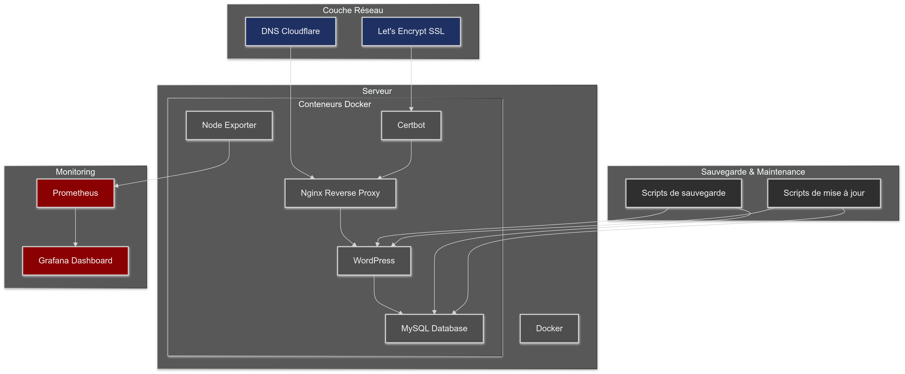
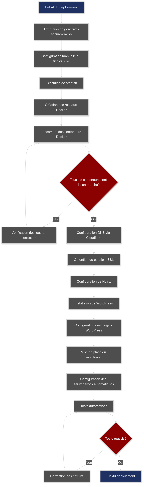
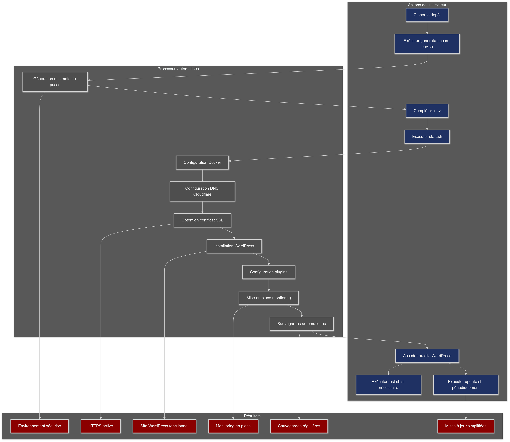

# WordPress Automatisé avec SSL

## Description

Ce projet fournit une solution complète et automatisée pour déployer un site WordPress sécurisé avec SSL, en utilisant Docker, Nginx, Let's Encrypt, et Cloudflare. Il offre une configuration "set-and-forget" qui gère automatiquement la plupart des aspects de l'installation et de la maintenance d'un site WordPress.

## Fonctionnalités

- Installation automatisée de WordPress
- Configuration SSL automatique avec Let's Encrypt
- Configuration DNS automatique via l'API Cloudflare
- Proxy inverse Nginx pour de meilleures performances et sécurité
- Sauvegardes automatiques
- Mises à jour simplifiées
- Tests automatisés
- Monitoring avec Prometheus

## Prérequis

- Docker et Docker Compose installés sur votre machine hôte
- Un compte Cloudflare avec un domaine configuré
- Un token API Cloudflare avec les permissions nécessaires

## Structure du projet

```
.
├── README.md
├── docker-compose.yml
├── env-example
├── generate-secure-env.sh
├── nginx.conf.template
├── start.sh
├── test.sh
├── update.sh
├── config/
│   └── wordpress-config.php
├── mysql-config/
│   └── my.cnf
├── prometheus/
│   └── prometheus.yml
└── scripts/
    ├── backup.sh
    ├── configure-dns.sh
    ├── init.sh
    └── setup-wordpress.sh
```

## Schémas et Diagrammes

Voici quelques schémas et diagrammes illustrant l'architecture et le fonctionnement de notre solution WordPress automatisée :


*Architecture générale de la solution WordPress automatisée*


*Schéma du flux de déploiement automatisé pour WordPress*


*Diagramme du flux automatisé pour WordPress*

## Installation

1. Clonez ce dépôt :
   ```
   git clone https://github.com/votre-username/Auto_Wordpress.git
   cd Auto_Wordpress
   ```

2. Générez un fichier `.env` sécurisé :
   ```
   chmod +x generate-secure-env.sh
   ./generate-secure-env.sh
   ```

3. Ouvrez le fichier `.env` généré et complétez les variables restantes comme DOMAIN, EMAIL, SERVER_IP, etc.

4. Rendez les scripts exécutables :
   ```
   chmod +x *.sh scripts/*.sh
   ```

5. Lancez le script de démarrage :
   ```
   ./start.sh
   ```

## Utilisation

### Démarrage

Pour démarrer votre application WordPress :

```
./start.sh
```

### Mise à jour

Pour mettre à jour votre système :

```
./update.sh
```

### Tests

Pour exécuter les tests automatisés :

```
./test.sh
```

## Maintenance

### Sauvegardes

Les sauvegardes sont effectuées automatiquement chaque jour. Pour effectuer une sauvegarde manuelle ou restaurer une sauvegarde, utilisez le script `backup.sh` dans le dossier `scripts/`.

### Monitoring

Le projet inclut une configuration Prometheus pour le monitoring. Vous pouvez accéder aux métriques via l'endpoint Prometheus configuré.

## Configuration MySQL

Le fichier `mysql-config/my.cnf` contient des optimisations pour MySQL. Ajustez ces paramètres selon vos besoins spécifiques.

## Dépannage

1. Vérifiez les logs des conteneurs :
   ```
   docker-compose logs [service]
   ```

2. Exécutez les tests automatisés :
   ```
   ./test.sh
   ```

3. Vérifiez la configuration Nginx :
   ```
   docker-compose exec nginx nginx -t
   ```

## Sécurité

- Utilisez le script `generate-secure-env.sh` pour générer des mots de passe sécurisés
- Maintenez tous les conteneurs à jour avec `./update.sh`
- Surveillez régulièrement les logs pour détecter toute activité suspecte
- Le fichier `wordpress-config.php` dans le dossier `config/` contient des paramètres de sécurité supplémentaires pour WordPress

## Mise en production

Avant de mettre en production :

1. Assurez-vous que tous les mots de passe dans le fichier `.env` sont forts et uniques
2. Vérifiez que le pare-feu de votre serveur autorise uniquement les ports nécessaires (80, 443)
3. Configurez des sauvegardes externes régulières
4. Testez le processus de restauration dans un environnement de staging