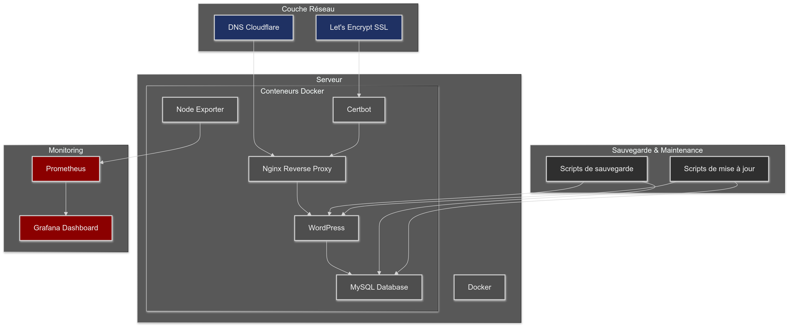
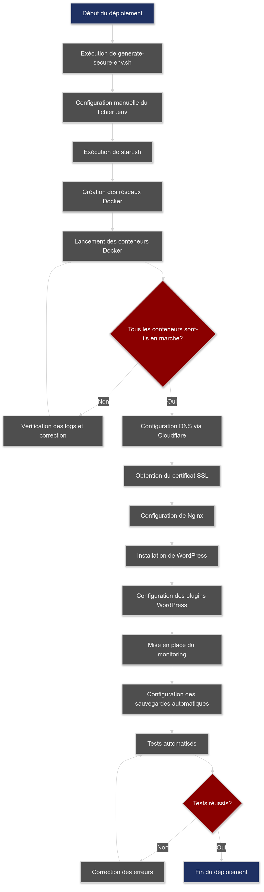
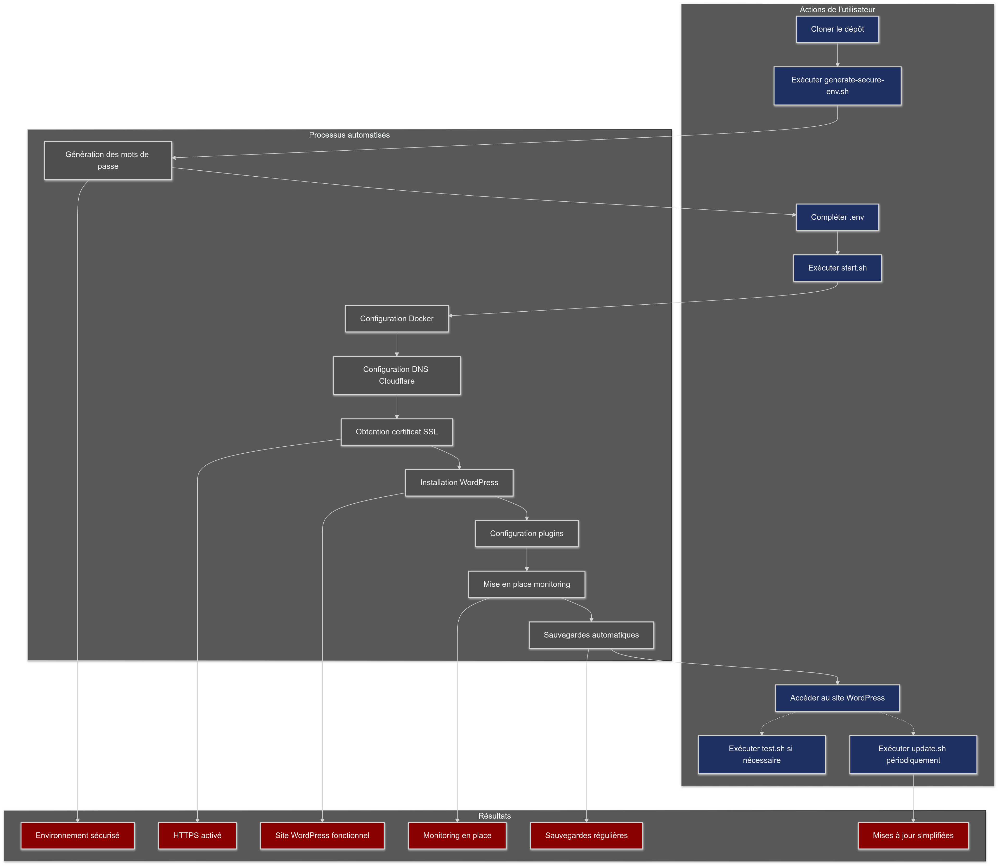

# WordPress Automatisé avec SSL

## Description

Ce projet fournit une solution complète et automatisée pour déployer un site WordPress sécurisé avec SSL, en utilisant Docker, Nginx, Let's Encrypt, et Cloudflare. Il offre une configuration "set-and-forget" qui gère automatiquement la plupart des aspects de l'installation et de la maintenance d'un site WordPress.

## Fonctionnalités

- Installation automatisée de WordPress
- Configuration SSL automatique avec Let's Encrypt
- Configuration DNS automatique via l'API Cloudflare
- Proxy inverse Nginx pour de meilleures performances et sécurité
- Sauvegardes automatiques
- Mises à jour simplifiées
- Tests automatisés
- Monitoring avec Prometheus

## Prérequis

- Docker et Docker Compose installés sur votre machine hôte
  - [Guide d'installation de Docker pour débutants](https://docs.docker.com/get-docker/)
  - [Guide d'installation de Docker Compose](https://docs.docker.com/compose/install/)
  
- Un compte Cloudflare avec un domaine configuré
  - [Comment créer un compte Cloudflare (gratuit)](https://dash.cloudflare.com/sign-up)
  - [Comment ajouter un domaine à Cloudflare](https://support.cloudflare.com/hc/fr-fr/articles/201720164-Commencer-avec-Cloudflare)
  
- Un token API Cloudflare avec les permissions nécessaires
  - Explications détaillées dans la section "Configuration des variables d'environnement" ci-dessous

## Structure du projet

```
.
├── README.md
├── docker-compose.yml
├── env-example
├── generate-secure-env.sh
├── nginx.conf.template
├── start.sh
├── test.sh
├── update.sh
├── config/
│   └── wordpress-config.php
├── mysql-config/
│   └── my.cnf
├── prometheus/
│   └── prometheus.yml
└── scripts/
    ├── backup.sh
    ├── configure-dns.sh
    ├── init.sh
    └── setup-wordpress.sh
```

## Schémas et Diagrammes

Voici quelques schémas et diagrammes illustrant l'architecture et le fonctionnement de notre solution WordPress automatisée :


*Architecture générale de la solution WordPress automatisée*


*Schéma du flux de déploiement automatisé pour WordPress*


*Diagramme du flux automatisé pour WordPress*

## Installation pour les débutants

### 1. Téléchargement du projet

Pour obtenir une copie de ce projet, vous devez utiliser Git pour "cloner" ce dépôt. Si vous n'avez jamais utilisé Git, voici comment procéder :

a) Installer Git :
   - Sur Windows : Téléchargez et installez depuis [git-scm.com](https://git-scm.com/download/win)
   - Sur Mac : Ouvrez le Terminal et tapez `brew install git` (avec Homebrew) ou installez Xcode Command Line Tools
   - Sur Linux (Ubuntu/Debian) : Exécutez `sudo apt-get install git`

b) Clonez ce dépôt :
   Ouvrez un terminal (invite de commandes) et tapez :
   ```
   git clone https://github.com/votre-username/Auto_Wordpress.git
   cd Auto_Wordpress
   ```

### 2. Préparation du fichier de configuration

Le projet utilise un fichier caché nommé `.env` qui contient toutes les informations de configuration. Pour le créer :

```
chmod +x generate-secure-env.sh
./generate-secure-env.sh
```

Ce script va créer automatiquement un fichier `.env` avec des mots de passe sécurisés générés aléatoirement. Il vous reste à compléter certaines informations.

### 3. Configuration des variables d'environnement

Ouvrez le fichier `.env` avec n'importe quel éditeur de texte (comme Notepad, TextEdit, VS Code, etc.) :

```
nano .env   # Si vous utilisez Linux/Mac
```
ou ouvrez-le avec votre éditeur graphique préféré.

Complétez les informations suivantes :

#### a) Informations de domaine et email

```
DOMAIN=votredomaine.com     # Remplacez par votre nom de domaine acheté (ex: monsite.fr)
EMAIL=votre@email.com       # Utilisé pour Let's Encrypt, mettez votre adresse email réelle
```

#### b) Adresse IP du serveur

```
SERVER_IP=xxx.xxx.xxx.xxx   # L'adresse IP publique de votre serveur
```

Pour trouver l'adresse IP de votre serveur :
- Si vous utilisez un VPS/serveur dédié : cette information est fournie par votre hébergeur
- Si vous êtes sur votre ordinateur personnel et souhaitez un test local : laissez 127.0.0.1
- Vous pouvez également utiliser des services comme [whatismyip.com](https://www.whatismyip.com/)

#### c) Configuration Cloudflare (pour gérer automatiquement votre DNS)

```
CLOUDFLARE_API_TOKEN=       # Votre token d'API Cloudflare
CLOUDFLARE_ZONE_ID=         # L'ID de zone de votre domaine
```

**Comment obtenir un token API Cloudflare :**
1. Connectez-vous à votre compte [Cloudflare](https://dash.cloudflare.com/)
2. Cliquez sur "Mon Profil" > "Jetons API" > "Créer un jeton"
3. Utilisez le modèle "Modifier la zone DNS"
4. Dans les permissions, assurez-vous d'avoir :
   - Zone > Zone > Lire
   - Zone > DNS > Modifier
5. Dans "Zone Resources", sélectionnez "Include" > "Specific zone" > *votre-domaine*
6. Cliquez sur "Continuer pour résumer" puis "Créer jeton"
7. Copiez le jeton généré et placez-le dans votre fichier `.env`

**Comment trouver votre Zone ID Cloudflare :**
1. Connectez-vous à votre compte [Cloudflare](https://dash.cloudflare.com/)
2. Sélectionnez votre domaine dans le tableau de bord
3. Sur la droite de l'écran, dans "Informations sur la zone API", vous trouverez "Zone ID"
4. Copiez cet identifiant et placez-le dans votre fichier `.env`

#### d) Informations d'administrateur WordPress

```
WP_ADMIN_USER=             # Nom d'utilisateur pour l'admin WordPress (généré automatiquement, vous pouvez le changer)
WP_ADMIN_PASSWORD=         # Mot de passe administrateur (généré automatiquement)
WP_ADMIN_EMAIL=admin@votredomaine.com  # Email pour récupérer le mot de passe si nécessaire
```

#### e) Nom du projet et mot de passe Grafana

```
COMPOSE_PROJECT_NAME=mon_projet_wordpress  # Donnez un nom unique à votre projet
GF_SECURITY_ADMIN_PASSWORD=                # Mot de passe pour accéder au tableau de bord Grafana
```

### 4. Rendre les scripts exécutables

Cette étape est nécessaire pour pouvoir lancer les scripts :

```
chmod +x *.sh scripts/*.sh
```

### 5. Démarrage de votre site WordPress

```
./start.sh
```

Ce script va :
- Vérifier que toutes les variables nécessaires sont présentes
- Créer les réseaux Docker nécessaires
- Démarrer tous les services (WordPress, MySQL, Nginx, etc.)
- Configurer automatiquement les certificats SSL pour votre domaine
- Mettre en place votre site WordPress

Attendez quelques minutes que tout se mette en place. Si le script se termine sans erreur, votre site est prêt !

## Accès à votre nouveau site WordPress

Une fois l'installation terminée, vous pouvez accéder à :

- Votre site WordPress : https://votredomaine.com
- Interface d'administration WordPress : https://votredomaine.com/wp-admin/
  - Identifiants : ceux que vous avez configurés dans `WP_ADMIN_USER` et `WP_ADMIN_PASSWORD`
- Tableau de bord Grafana (monitoring) : http://votredomaine.com:3000
  - Identifiants : admin / `GF_SECURITY_ADMIN_PASSWORD`

## Résolution des problèmes courants

### Je ne peux pas me connecter à mon site

1. Vérifiez que le DNS est correctement configuré
   - Assurez-vous que votre domaine pointe bien vers l'adresse IP de votre serveur
   - Cela peut prendre jusqu'à 24-48h pour que les changements DNS se propagent

2. Vérifiez que les ports sont ouverts
   - Les ports 80 et 443 doivent être ouverts sur votre serveur
   - Si vous utilisez un pare-feu : `sudo ufw allow 80/tcp` et `sudo ufw allow 443/tcp`

3. Vérifiez l'état des conteneurs
   ```
   docker-compose ps
   ```
   Tous les services doivent être à l'état "Up"

### Les certificats SSL ne fonctionnent pas

1. Vérifiez les logs de Certbot
   ```
   docker-compose logs certbot
   ```

2. Assurez-vous que votre domaine est correctement configuré dans Cloudflare
   - Le DNS doit pointer vers votre serveur
   - SSL doit être en mode "Flexible" ou "Full" dans Cloudflare

## Utilisation quotidienne

### Démarrage

Pour démarrer votre application WordPress :

```
./start.sh
```

### Mise à jour

Pour mettre à jour votre système (WordPress, plugins, thèmes) :

```
./update.sh
```

### Tests

Pour vérifier que tout fonctionne correctement :

```
./test.sh
```

## Maintenance

### Sauvegardes

Les sauvegardes sont effectuées automatiquement chaque jour. Pour faire une sauvegarde manuelle :

```
cd scripts
./backup.sh create
```

Pour restaurer une sauvegarde :

```
cd scripts
./backup.sh restore NOM_DE_LA_SAUVEGARDE
```

Les sauvegardes sont stockées dans un dossier `backups/` à la racine du projet.

### Monitoring

Le projet inclut Prometheus et Grafana pour surveiller les performances de votre site :

1. Accédez à Grafana : http://votredomaine.com:3000
2. Connectez-vous avec le nom d'utilisateur "admin" et le mot de passe que vous avez défini dans `GF_SECURITY_ADMIN_PASSWORD`
3. Vous y trouverez des tableaux de bord pré-configurés pour suivre les performances de votre serveur et de votre site WordPress

## Configuration MySQL avancée

Le fichier `mysql-config/my.cnf` contient des optimisations pour MySQL. Pour la plupart des utilisateurs, les paramètres par défaut fonctionnent bien. Si vous avez besoin de plus de performances, vous pouvez ajuster ces paramètres selon votre matériel.

## Dépannage

1. Vérifiez les logs des conteneurs :
   ```
   docker-compose logs [service]
   ```
   Remplacez [service] par wordpress, db, nginx, etc.

2. Exécutez les tests automatisés :
   ```
   ./test.sh
   ```

3. Vérifiez la configuration Nginx :
   ```
   docker-compose exec nginx nginx -t
   ```

4. Redémarrez un service spécifique :
   ```
   docker-compose restart [service]
   ```

## Sécurité

- Les mots de passe sécurisés sont générés automatiquement par le script `generate-secure-env.sh`
- Maintenez tous les conteneurs à jour avec `./update.sh`
- Vérifiez régulièrement les logs pour détecter toute activité suspecte :
  ```
  docker-compose logs --tail=100
  ```
- Le fichier `wordpress-config.php` dans le dossier `config/` contient des paramètres de sécurité supplémentaires

## Mise en production

Avant de mettre en production votre site pour un usage professionnel :

1. Assurez-vous que tous les mots de passe dans le fichier `.env` sont forts et uniques
2. Vérifiez que le pare-feu de votre serveur autorise uniquement les ports nécessaires (80, 443)
   ```
   sudo ufw status
   ```
3. Configurez des sauvegardes externes (idéalement sur un autre serveur ou un service de stockage cloud)
4. Testez le processus de restauration pour vous assurer que vous pouvez récupérer votre site en cas de problème
5. Envisagez de mettre en place une surveillance supplémentaire avec des services comme Uptime Robot (gratuit) pour être alerté si votre site tombe en panne